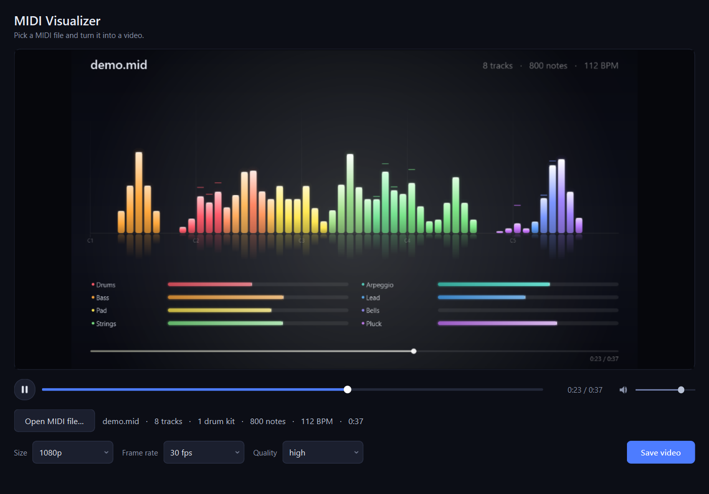

# MIDI Visualizer

Turns a MIDI file into a video: the MIDI is synthesized to become the audio
track, and the notes drive an animation of bars that become the video track.



## Install

```bash
pip install -r requirements.txt
```

You also need **ffmpeg** on your `PATH` (it writes the MP4):

| OS      | Command                       |
| ------- | ----------------------------- |
| Windows | `winget install Gyan.FFmpeg`  |
| macOS   | `brew install ffmpeg`         |
| Linux   | `sudo apt install ffmpeg`     |

No SoundFont is required — the audio is synthesized in-process (see
[Audio](#audio) below).

## Use

Double-click **`run.bat`**. It finds Python, installs the libraries the first
time, and opens the window. On macOS or Linux, or from a terminal:

```bash
python main.py
```

Open a MIDI file (or drag one onto the window), then press play. The preview
shows the animation **with sound**: the audio is synthesized in the background
as soon as the file loads, so the picture appears at once and gains sound a few
seconds later. Click anywhere on the timeline to jump to that moment.

When you are happy with it, press **Save video**. The finished MP4 plays back
in the same window. Change a setting while it is playing and the video is
rebuilt with it, picking up from the same moment.

The volume slider next to the timeline controls listening in the app only; the
audio written into a saved file is always at full level.

To render without the interface, pass an output path:

```bash
python main.py song.mid -o song.mp4
```

| Option      | Values                     | Default |
| ----------- | -------------------------- | ------- |
| `--size`    | `720p`, `1080p`, `1440p`   | `1080p` |
| `--fps`     | `24`, `30`, `60`           | `30`    |
| `--quality` | `high`, `balanced`, `fast` | `high`  |
| `--wav`     | path                       | —       |

## The data folder

Everything lives in **`data/`**: it is where the Open dialog starts and where
finished videos are saved. Put your own `.mid` files there.

Because that is the default, a bare file name is looked up there too, so
`run.bat demo.mid -o out.mp4` finds `data/demo.mid` and writes `data/out.mp4`.

A short sample, `data/demo.mid`, is included so there is something to try
straight away.

## How the MIDI drives the animation

Every visual property is derived from the score rather than from the audio
waveform, so the animation is exactly in step with the notes.

| Visual                | Driven by                                                        |
| --------------------- | ---------------------------------------------------------------- |
| Pitch-bar height      | Note velocity shaped by an attack/decay/release envelope          |
| Pitch-bar position    | Note pitch — bars run low to high, left to right                  |
| Pitch-bar colour      | The track the note belongs to; bars under several tracks blend    |
| Bar brightness / glow | Current energy of that bar, so louder notes flare wider           |
| Track-bar length      | Summed energy of that track, normalized to its own busy moments   |
| Falling-bar speed     | Tempo — a faster piece drops its bars and tightens its pulse more |
| Envelope attack/decay | Each note's own duration                                          |
| Background tint       | Colour of whichever tracks are loudest at that moment             |
| Baseline pulse        | Beat grid, with a stronger flash on the first beat of each bar    |

Tracks are separated by `(track, channel)` pairs, so both layouts work: a type-1
file with one instrument per track, and a type-0 file with everything on one
track split across channels. Each of the first ten tracks gets its own colour;
beyond ten the palette repeats.

## Audio

ffmpeg has no MIDI decoder, and FluidSynth with a SoundFont may not be present,
so `midiviz/synth.py` renders the audio itself with numpy:

- **Band-limited wavetables.** One mip level per octave holds only the harmonics
  that stay under Nyquist for that octave, so nothing aliases. Notes are played
  by phase-accumulated table lookup with linear interpolation.
- **Sixteen instrument families** mapped from the General MIDI program number,
  each with its own spectrum, envelope and unison detune.
- **Percussion** on channel 10 is synthesized separately, from noise shaped in
  the frequency domain plus pitch-swept sine bodies.
- **Mixing** honours CC7 volume and CC10 pan, spreads tracks across the stereo
  field when no pan is set, then applies a convolution reverb, soft saturation
  and peak normalization.

It is a synthesizer, not a sampler, so the result sounds like a clean synth
rather than a real orchestra. To use a SoundFont instead, replace
`render_score()` in `midiviz/synth.py`; nothing else depends on how the audio is
produced.

## Layout

```
run.bat                 double-click to start the app on Windows
main.py                 entry point: GUI, or CLI when given an output path
data/                   your MIDI files in, finished videos out
midiviz/
  midi_parser.py        MIDI to a flat Score (notes in seconds, tempo map, beats)
  synth.py              wavetable synthesizer, Score to stereo audio
  renderer.py           per-frame animation curves, and painting with QPainter
  video.py              frame piping and muxing through ffmpeg
  pipeline.py           the one path both the GUI and the CLI run
  paths.py              where files are read from and written to
  ui.py                 the PyQt6 window
  gm.py                 General MIDI names and instrument families
```

A render takes roughly as long as the piece itself at 1080p30 on a typical
laptop: about 38 seconds of work for a 40-second track.
